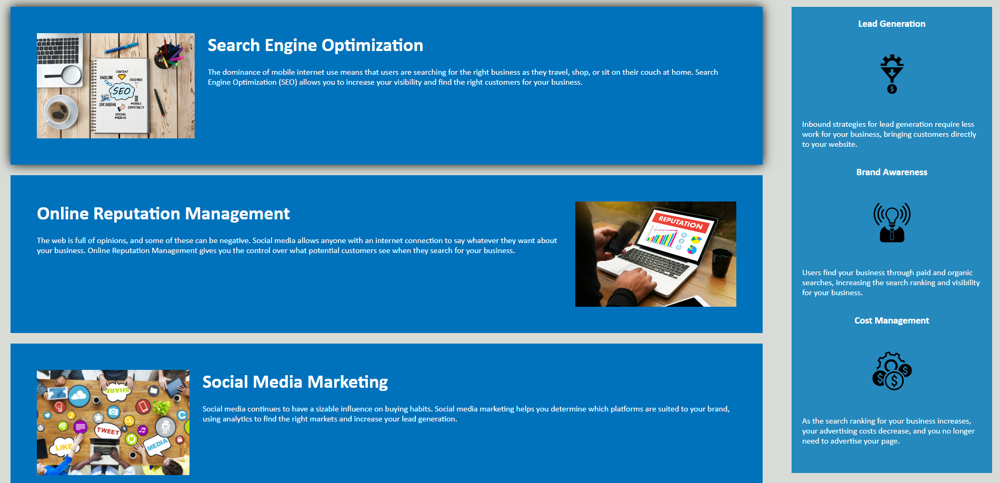

# 01 HTML, CSS, and Git: Code Refactor

## Description
- this website is optimized for search engines and follows accessibility standards for marketing agencies

## Installation
- git clone this app at https://www.github.com/Edesp1/Code-refractor or view this deployed website here https://edesp1.github.io/Code-refractor/

## usage
- once loaded onto the site you will be met this page
 
- you can click the nav links on the top right to be brough down to this part of the page
 

## Collaborations
- Collaborations are closed until further notice thank you

## License
- This project is under the MIT license
## Badges
